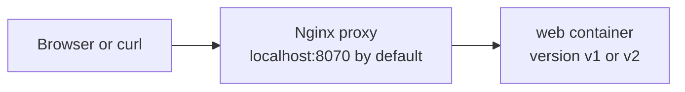
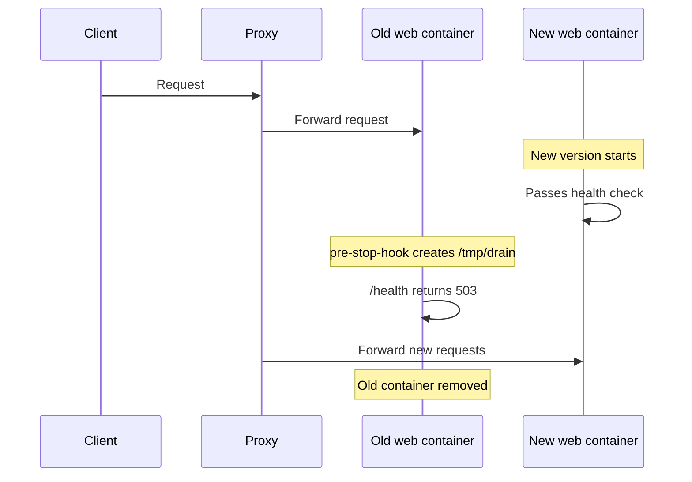
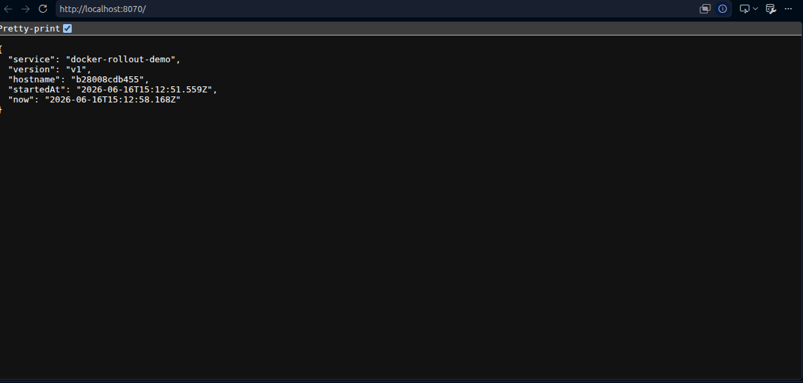

# Docker Rollout Guide

This guide explains what rollout means in this demo, how traffic moves through the stack, and how to prove that the deployment happened without visible downtime.

## What is rollout?

In this project, a rollout means replacing the running `web` container with a new version while the proxy continues serving requests.

With plain `docker compose up`, Docker typically stops the old container before the new one is fully ready. That creates a gap where requests can fail.

`docker rollout web` avoids that gap by:

1. Starting a new `web` container alongside the old one.
2. Waiting for the new container to pass health checks.
3. Draining the old container.
4. Removing the old container only after the new one is ready.

## How this demo is wired



The important design decision is that only the proxy publishes a host port. The `web` service does not publish a host port, which keeps the setup compatible with `docker-rollout`.

## Why the caveats matter

`docker-rollout` scales a service temporarily during deployment. Because of that:

- `web` must not use `container_name`
- `web` must not bind a fixed host `ports` mapping
- a proxy must sit in front of the app and forward traffic internally

This repository follows that pattern in [docker-compose.yml](/home/adorsys/Desktop/dev/personal-projects/kodecloud/docker-rollout-test/docker-compose.yml).

## Health and draining

The app exposes `/health` and returns `503` when `/tmp/drain` exists.

That drain marker is created by the pre-stop hook label on the `web` service:

```yaml
docker-rollout.pre-stop-hook: "touch /tmp/drain && sleep 8"
```

That means the old container is marked unhealthy first, giving the proxy time to stop sending traffic to it before Docker removes it.



## What the screenshots show

Before rollout, the app reports version `v1`:



After rollout, the app reports version `v2` and a different hostname:


The hostname change matters because it proves the response came from a different container, not the same process.

## Files involved in the rollout

- [docker-compose.yml](/home/adorsys/Desktop/dev/personal-projects/kodecloud/docker-rollout-test/docker-compose.yml): defines `proxy` and `web`
- [nginx.conf](/home/adorsys/Desktop/dev/personal-projects/kodecloud/docker-rollout-test/nginx.conf): proxy forwards traffic to `web:3000`
- [app/server.js](/home/adorsys/Desktop/dev/personal-projects/kodecloud/docker-rollout-test/app/server.js): serves version data and drain-aware health status
- [scripts/deploy.sh](/home/adorsys/Desktop/dev/personal-projects/kodecloud/docker-rollout-test/scripts/deploy.sh): builds and runs `docker rollout web`

## How to verify rollout in action

Start the initial version:

```sh
docker compose down
PROXY_PORT=8070 APP_VERSION=v1 docker compose up -d --build
curl -s http://localhost:8070
```

In another terminal, generate steady traffic:

```sh
while true; do
  ts="$(date +%H:%M:%S)"
  body="$(curl -sS --max-time 1 http://localhost:8070 || echo FAIL)"
  echo "$ts $body"
  sleep 0.5
done
```

Trigger the rollout:

```sh
APP_VERSION=v2 PROXY_PORT=8070 ./scripts/deploy.sh
```

What you should observe:

1. Requests continue returning responses during the deployment.
2. The `version` field changes from `v1` to `v2`.
3. The `hostname` changes, proving a new container took over.
4. The old container disappears after the new one is healthy.

## How to inspect the deployment

```sh
docker compose ps
docker ps --format 'table {{.Names}}\t{{.Status}}'
docker logs --tail 100 docker-rollout-test-web-1
```

If the old container name no longer exists after rollout, that is expected. `docker-rollout` increments and replaces the service containers over time.

## Security note

The app image uses a Chainguard runtime base so the rollout demo stays aligned with the CI security scan in [.github/workflows/ci-security.yml](/home/adorsys/Desktop/dev/personal-projects/kodecloud/docker-rollout-test/.github/workflows/ci-security.yml).